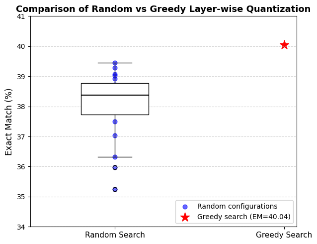

# Efficient LLMs via Switcble and Dynamic Quantization (SDQ)

This is the implementation of the coding test from `EIC Lab`.

## Overview

- Model: [GPT-2 small](https://huggingface.co/openai-community/gpt2)
- Dataset: [SQuAD v1.1](https://huggingface.co/datasets/rajpurkar/squad)
- Task: Question Answering
- Quantization Function: [LLM-QAT](https://arxiv.org/pdf/2305.17888)

## Run

### Requirements

- Python 3.12, PyTorch 2.0 compatible with local CUDA version
- pip install -r requirements.txt

### Start

```sh
git clone https://github.com/xiyuLiang09/Efficient-LLMs-via-SDQ.git

cd Efficient-LLMs-via-SDQ
```

#### Convert Linear GPT2

Since the weight storage shape of the [Conv1D](https://github.com/huggingface/transformers/blob/main/src/transformers/pytorch_utils.py#L98) layer is `[out_features, in_features]`, while that of [nn.Linear](https://github.com/pytorch/pytorch/blob/main/torch/nn/modules/linear.py#L53) layer is `[in_features, out_features]`, it is necessary to transpose the pre-trained weights of GPT2 and replace the original `Conv1D` layer with `Linear` layer before training.

Run the script `scripts/convert_linear_gpt2.sh`, and the model weights will be saved in `model/linear_gpt2`.

### Training

#### 1. Switchable Precision Training (SP)

  The training function not only supports switchable precision training but also incorporates cascade distillation from [InstantNet](https://arxiv.org/pdf/2104.10853) to improve model performance at low precision. Use the script `run_sp.sh` in the `./scripts` folder to tune the model with SP:

```sh
bash scripts/run_sp.sh $output_dir
```

An example command:

```sh
bash scripts/run_sp.sh model/tuned_gpt2_sp
```
  
Or use the following command to run the customized training parameters. Note that the `--training_strategy` should be set to `sp`:

```sh
python train.py \
  --model_path model/linear_gpt2 \
  --dataset_path rajpurkar/squad \
  --training_strategy sp \
  --num_epochs 1 \
  --batch_size 24 \
  --gradient_accumulation_steps 3 \
  --max_steps 1000 \
  --lr_schedule cosine \
  --distill_weight 1 \
  --learning_rate 1e-3 \
  --output_dir model/tuned_gpt2_sp \
```

#### 2. Cyclic Precision Training (CPT)

  First, perform a precision range test on the model to determine the lower bound of the precision range for cyclic precision training. Use the following command, then the visualization result will be saved directly in the current directory:

```sh
bash scripts/prec_range_test.sh
```

  To enable the training bit-widths to be changed dynamically (i.e., use the cyclic precision training), use the script `run_cpt.sh` in the `./scripts` folder directly to tune the model with cyclic precision:

```sh
bash scripts/run_cpt.sh $output_dir
```

An example command:

```sh
bash scripts/run_cpt.sh model/tuned_gpt2_cpt
```

  Similar to using switchable precision training, you can also use the following command, but make sure to set `--training_strategy` to `cpt`:

```sh
python train.py \
  --model_path model/linear_gpt2 \
  --dataset_path rajpurkar/squad \
  --training_strategy cpt \
  --num_cyclic_period 5 \
  --num_epochs 1 \
  --batch_size 24 \
  --max_steps 1000 \
  --gradient_accumulation_steps 3 \
  --lr_schedule cosine \
  --learning_rate 1e-3 \
  --output_dir model/tuned_gpt2_cpt \
  --do_eval
```

After training, the model weights, LoRA module weights (two `.pt` files), and training configuration (one `.json` file) will all be saved in the corresponding `$output_dir` (there is no need to manually create the folder — it will be created automatically if it does not exist, and the model weights will be saved there).

### Search (for SP training)

To determine the optimal per-layer bit-width configuration to push the accuracy-efficiency trade-off, we adopt a simple and effective greedy search algorithm to find a locally optimal solution.

Use the script `run_greedy_search.sh` in the `./scripts` folder to run the greedy search. 

- `$model_dir` refers to the path where the tuned model wights are saved.

```sh
bash scripts/run_greedy_search.sh $model_dir
```

An example command:

```sh
bash scripts/run_greedy_search.sh model/tuned_gpt2_sp
```

Then, the search result (i.e., the optimal per-layer bit-width configuration, which can be used in `evaluation` phase directly) will be saved in `configs/greedy_search_config.json`. Note that the process may be a bit time-consuming if there is only a single GPU.

Alternatively, you can use the following command to run the customized searching parameters. The `--searching_method` should be set to `greedy`:

```sh
python bit_search.py \
    --model_dir model/tuned_gpt2_sp \
    --search_method greedy \
    --output_path configs/greedy_search_config.json \
    --low_bits 4 \
    --high_bits 8 \
    --lower_bound 40.34 \
    --alpha 0.7 \
    --batch_size 24 \
```

To validate the effectiveness of our search method, 20 randomly selected bit-width configurations are used to evaluate. In random search, the numbers of `high-bit` and `low-bit` layers are the **same** as in greedy search. The comparison results after 20 runs of random search are as follows:

<!--  -->
<div align="center">
  
</div>

### Evaluation

Evaluate the tuned model with specified bit-widths configuration. Use the following command to run the customized evaluation parameters:

```sh
python eval.py \
    --model_dir model/tuned_gpt2_sp \
    --config_path configs/greedy_search_config.json \
    --output_path output/tuned_gpt2_sp.json
```

- `--model_dir`: path to the folder containing the tuned model weights to be evaluated.
- `--config_path`: path to the bit-width configuration file to be evaluated.